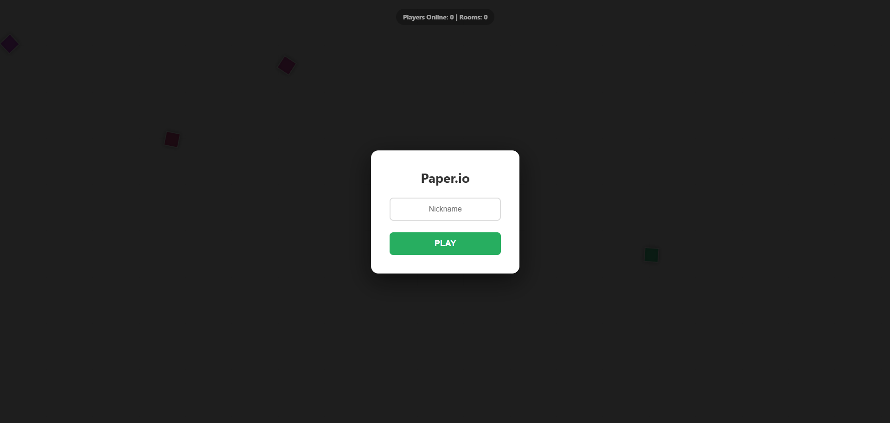
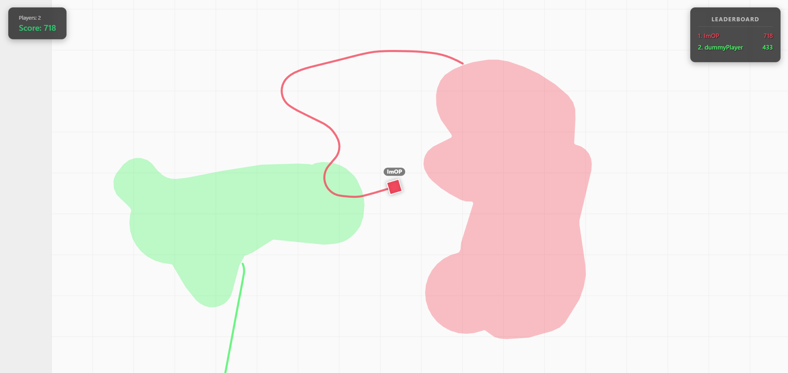
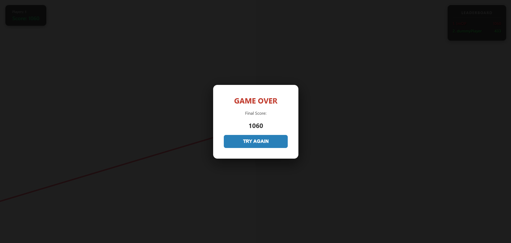

# Paper.io - High-Performance Java Backend

A standalone, server-authoritative replica of Paper.io built with **Spring Boot 3** and **Java Topology Suite (JTS)**. This project focuses on solving the classic "io game" challenges: real-time geometry calculations, spatial partitioning, and concurrent room management.

---

## Tech Stack
* **Backend:** Java 21 / Spring Boot 3 (WebSockets).
* **Geometry Engine:** JTS (Java Topology Suite) for polygon clipping and union operations.
* **Networking:** Low-latency WebSockets with a lightweight custom JSON protocol.
* **Frontend:** Vanilla ES6+ JavaScript, HTML5 Canvas, CSS Glass-morphism.
* **Observability:** Logback with multi-file routing and automatic Gzip archiving.

---

## Architectural Highlights

### 1. Multi-Threaded Game Engine
The engine manages multiple `GameRoom` instances using a `parallelStream` tick-loop. Each room is isolated with a unique **UUID**, preventing ID enumeration attacks and ensuring clean resource lifecycle management.

### 2. Geometry Optimization
* **Morphological Closing:** Aggressive `buffer(5).buffer(-5)` to seal gaps and prevent the "hole bug."
* **Topology Simplification:** `TopologyPreservingSimplifier` reduces vertex count before broadcasting, saving bandwidth.
* **Envelope Culling:** Fast-path intersection checks using Bounding Boxes before triggering expensive JTS clipping.

### 3. Area of Interest (AOI)
To support high concurrent player counts, the server implements **Spatial Culling**. Instead of broadcasting the whole map, players only receive updates for entities within their `VISIBILITY_RADIUS`. This includes:
* Dynamic head/trail data.
* Intersecting territory fragments (Culling based on Envelopes/Bounding Boxes).

### 4. Room Lifecycle & Grace Period
5-second **Grace Period** for newly created rooms to prevent race conditions during player handshakes. Automatic **Room Pruning** cleans up inactive instances to keep the CPU focused on active sessions.

---

## Performance & Stress Testing
Built-in **JUnit 5 Microbenchmarks** for stress testing the engine:
* **Avg Tick Time:** < 8ms for 100 players in a single room.
* **Scalability:** Validated for 3000+ players distributed across parallelized rooms.

---

## Gameplay Preview

### 1. Main Menu

### 2. Gameplay

### 3. Game Over Screen
